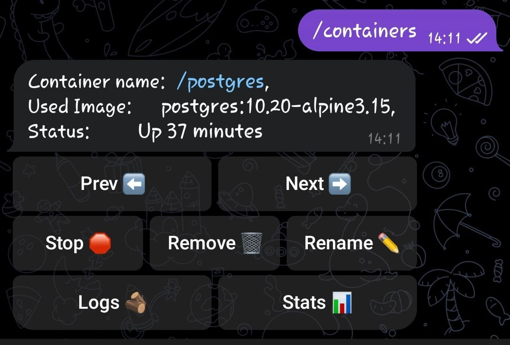
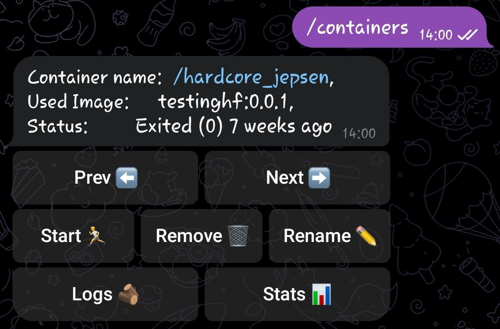
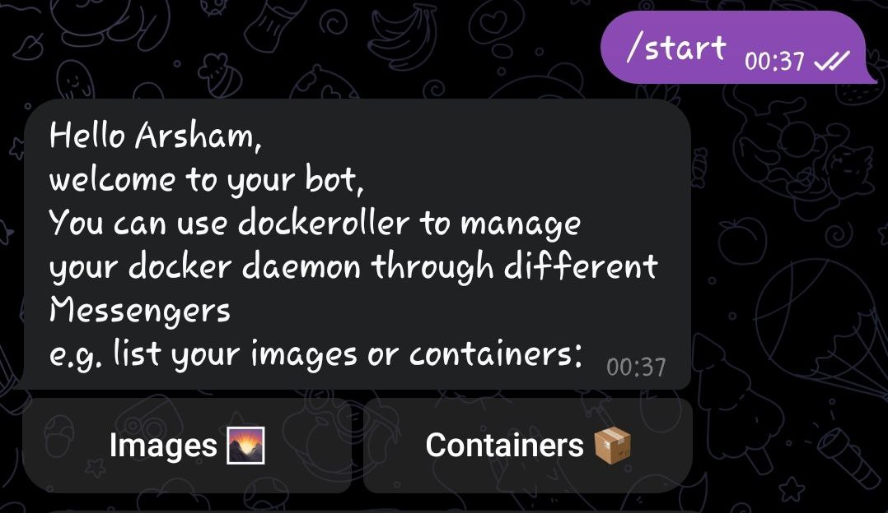

# Dockeroller 🐳

Dockeroller (docker controller) is an open-source project giving you the power to control your docker daemon through Telegram, it was made for fun and personal use, but it appears to have many real-world use cases and it is a part of ChatOps world!

> [!IMPORTANT]
> Dockeroller is made to run self-hosted, so WE WON'T ACCESS or STORE ANY OF YOUR DATA in any terms.

> [!CAUTION]
> Dockeroller is in Alpha phase and not yet production-ready

## How to use
First make sure you installed go version 1.19 or above then run:
````bash
go install github.com/arshamalh/dockeroller@main
````
Then you should make a bot (it's name and username doesn't matter) with [bot father](https://t.me/BotFather), copy its `token`, then you can run the CLI using:
```bash
dockeroller start --token "<YOUR-TOKEN>"
```
And now your docker daemon is accessible thorough your Telegram bot.

## Security
There is no security concerns as long as you keep your telegram account safe, and Whitelist known ids:
```bash
dockeroller start -w 22,33,44
```
Dockeroller will return your ChatID when you message it in an UnAuthorized state, then you can whitelist it.

We will also add a password mechanism soon.

## Features
- [x] Containers
    - [x] List
    - [x] Start
    - [x] Stop
    - [x] Live logs
    - [x] Live stats
    - [x] Remove
    - [x] Rename
- [ ] Images
    - [x] List
    - [x] Remove
    - [x] Tagging

## Note for developers and contributors
We cache containers and images list, and update this cache after "next, back, list, final rename, final remove" but we don't update this cache after "remove form buttons clicking", because we don't want you to face another container after clicking to "Force: false" button.

## Some Screen Shots



